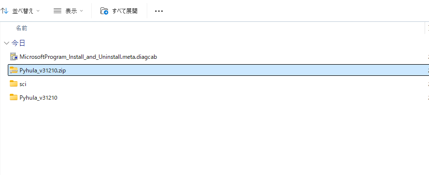
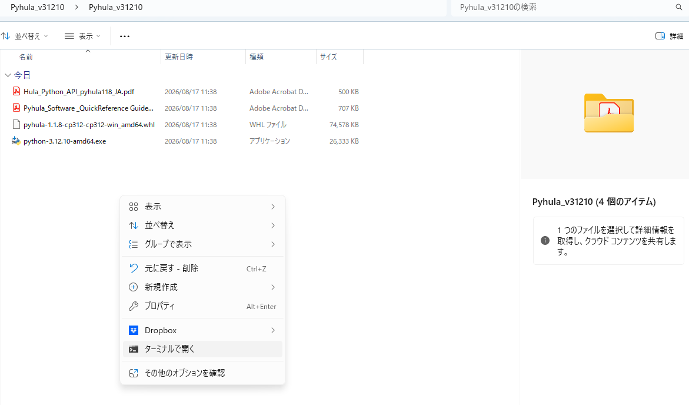
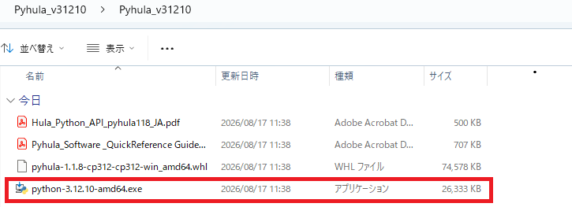
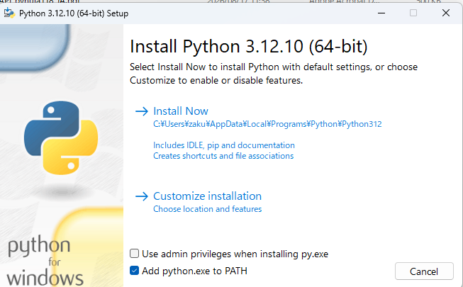
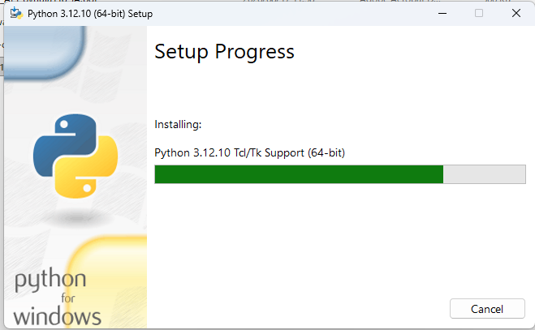
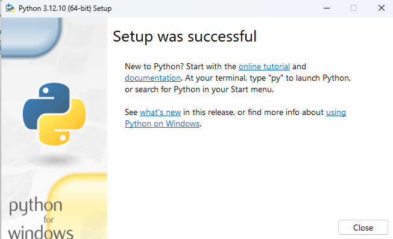
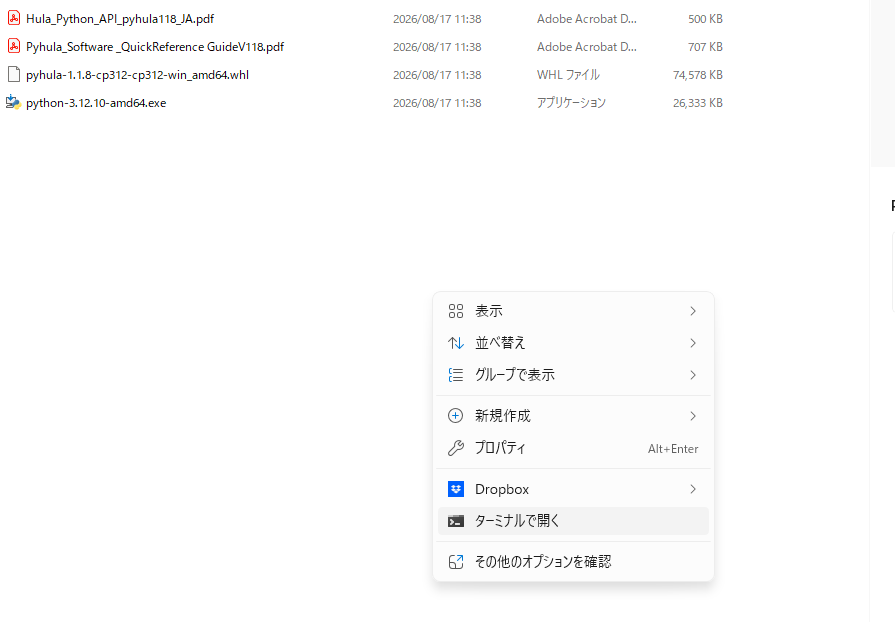
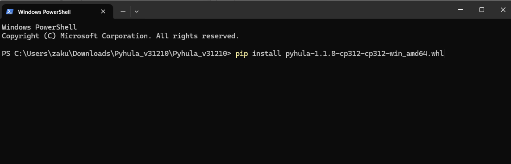
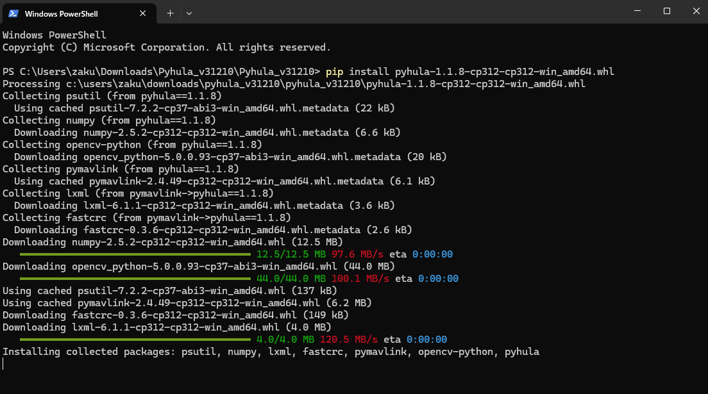

# install

Hula-jpにPythonのライブラリで制御するためには、pyhulaをインストールする必要があります。
レッドクリフのHula-jpの公式サイトからダウンロードすることが可能です。

## Hula-jp
https://redcliff-inc.co.jp/service/drone-sales-and-subscription/hula/

Hula-jp Python[3.12.10]インストールパッケージをダウンロードして



展開して下さい。



問題がなければ、Pyhtonのバージョンは3.12.10にしてください。
zipファイルにインストールするためのexe.実行ファイルがあります。
以下のフィルを実行してください。

```bash
python-3.12.10-amd64.exe
```

Add python.exe to Pathにチェックを入れてください。




















